<div align="center">

# YapCap

**A native COSMIC panel applet that tracks AI coding quota for Codex, Claude Code, Cursor, Antigravity, Gemini, Minimax, GitHub Copilot, Kimi for Coding, and OpenCode Go.**

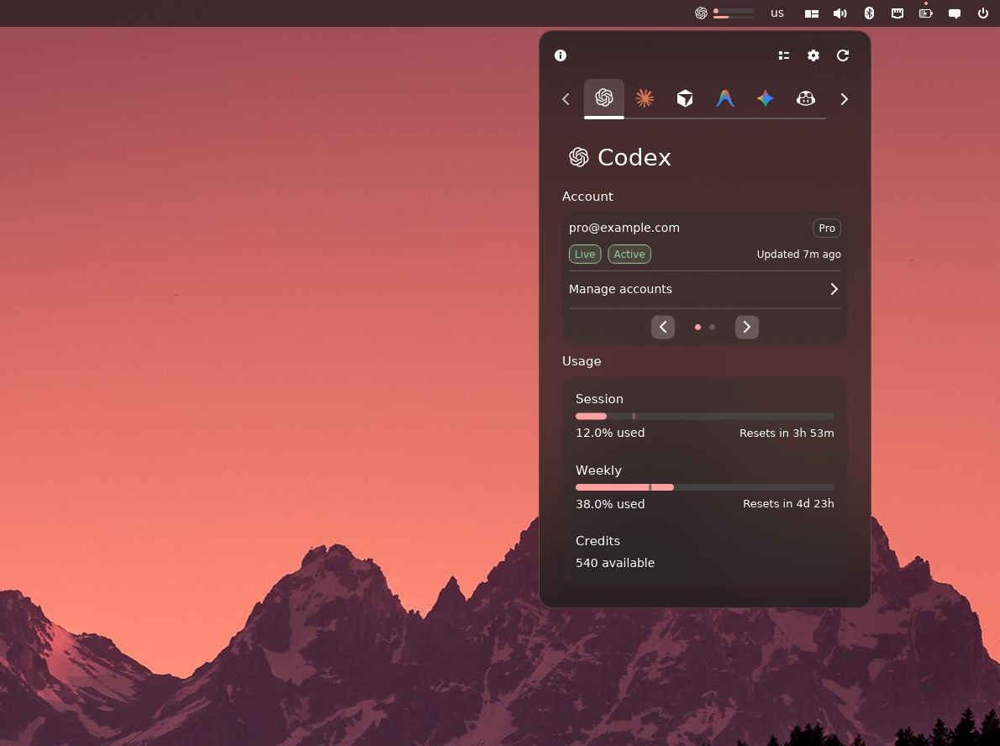

[](https://github.com/TopiCsarno/yapcap/actions/workflows/ci.yml)
[](https://github.com/TopiCsarno/yapcap/releases/latest)
[](LICENSE)

[Report a bug](https://github.com/TopiCsarno/yapcap/issues)

</div>

---

## What it does

YapCap lives in your COSMIC panel and shows how much of your AI coding quota you've used — without sending anything to a third party. All data is fetched directly from provider APIs using accounts you add in YapCap. No telemetry, no cloud sync, no separate account needed.

## Highlights

- 🤖 **Providers**
    - **Codex** — 5h/weekly windows + credits
    - **Claude** — session/weekly/extra usage
    - **Cursor** — Auto/Composer and API usage 
    - **Antigravity** — grouped Gemini and Claude/GPT model quota (5h + weekly)
    - **Gemini** — Pro / Flash / Lite quota bars (OAuth accounts only)
    - **Minimax** — API key usage tracking
    - **GitHub Copilot** — Free chat/completions or paid premium interactions
    - **Kimi for Coding** — API key usage tracking with weekly and rate-limit windows
    - **OpenCode Go** — API key usage tracking with 5-hour, weekly, and monthly windows
- 👥 **Multi-account view** — add, switch, and remove accounts per provider. Turn on **Show all accounts** to lay out each selected account side by side in the popup and show one usage-bar group per account in the panel.
- 🔎 **Automatic discovery** — detected providers appear automatically, provider availability updates live, and an empty setup points directly to Settings. Gemini remains opt-in and must be enabled manually.
- 🔐 **In-app login** — guided browser login for Codex, Claude, Antigravity, Gemini, and Copilot; API-key forms for Minimax, Kimi, and OpenCode Go; Cursor scans the local IDE state.
- 🔑 **OpenCode integration** — compatible keys can optionally prefill Minimax, Kimi, and OpenCode Go forms; Codex and Copilot offer explicit OAuth imports. Credentials are copied only after confirmation and are never synchronized with OpenCode.
- ✅ **Active badge** — marks the account currently in use by the host tool or environment for Codex, Claude, Cursor, Gemini, Minimax, Kimi, and OpenCode Go.
- ⚙️ **Configurable panel** — logo+bars, bars only, logo+%, or %-only; used/left toggle; relative or absolute reset times.

## Screenshots

<table>
<tr>
<td align="center" valign="top" width="33%">

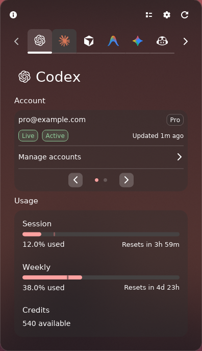

</td>
<td align="center" valign="top" width="33%">

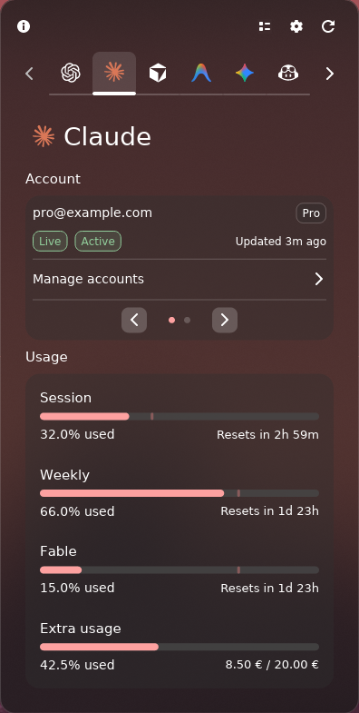

</td>
<td align="center" valign="top" width="33%">

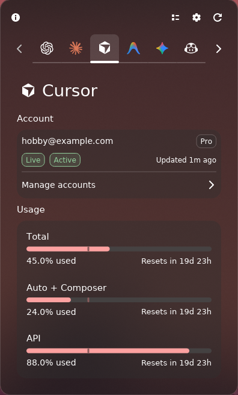

</td>
</tr>
<tr>
<td align="center" valign="top" width="33%">

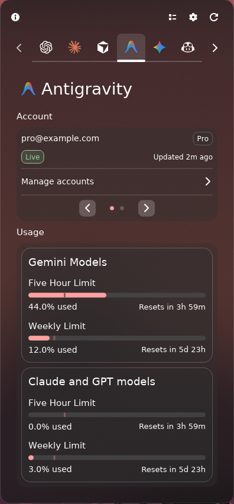

</td>
<td align="center" valign="top" width="33%">

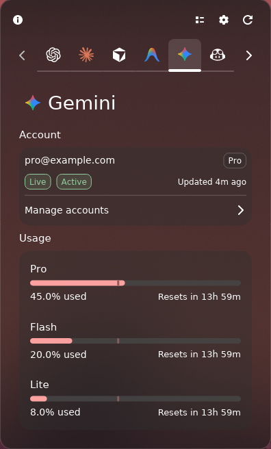

</td>
<td align="center" valign="top" width="33%">

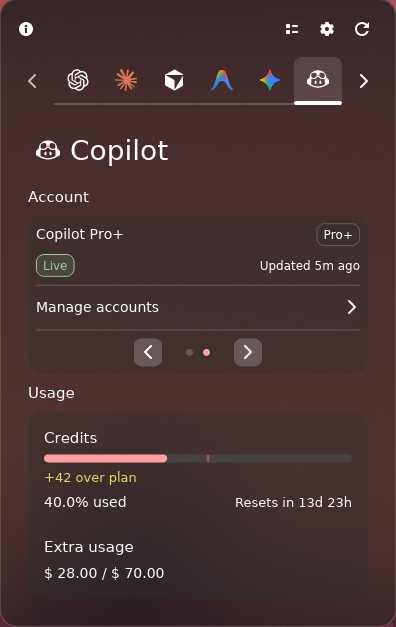

</td>
</tr>
<tr>
<td align="center" valign="top" width="33%">

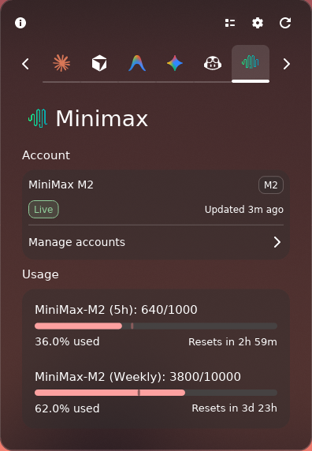

</td>
<td align="center" valign="top" width="33%">

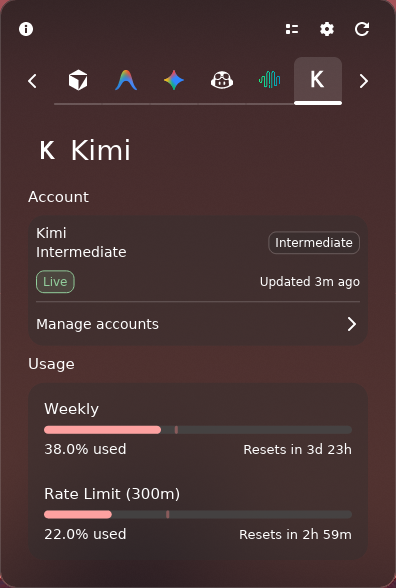

</td>
<td align="center" valign="top" width="33%"></td>
</tr>
</table>

<table>
<tr>
<td align="center" valign="top" width="50%">

<strong>Settings — General</strong><br />
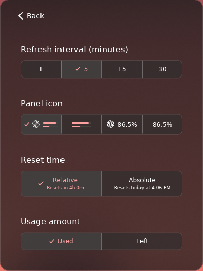

</td>
<td align="center" valign="top" width="50%">

<strong>Settings — Accounts</strong><br />
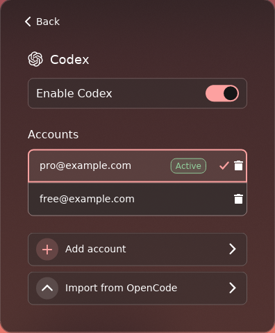

</td>
</tr>
</table>

**COSMIC system theme** — YapCap follows your COSMIC system theme; the popup and panel pick up light or dark mode and accent colors from your desktop appearance settings.

<table>
<tr>
<td align="center" valign="top" width="25%">
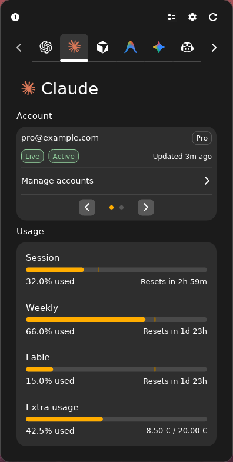
</td>
<td align="center" valign="top" width="25%">
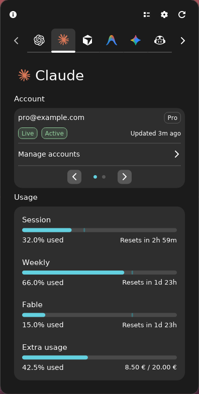
</td>
<td align="center" valign="top" width="25%">
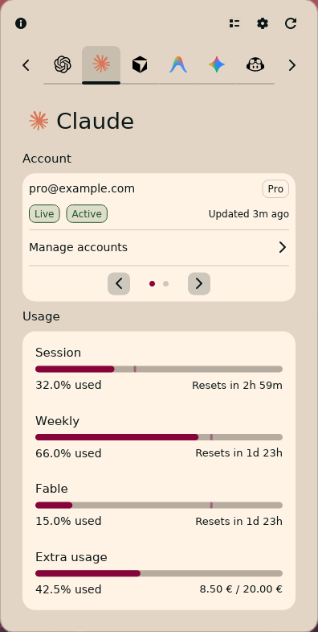
</td>
<td align="center" valign="top" width="25%">
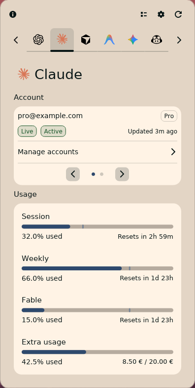
</td>
</tr>
</table>

## Install

### COSMIC Store (recommended)

Install **YapCap** from the COSMIC Store and receive automatic updates. 

If you prefer the command line and have the COSMIC Flatpak remote configured:

```bash
flatpak remote-add --if-not-exists --user cosmic https://apt.pop-os.org/cosmic/cosmic.flatpakrepo
flatpak install --user cosmic io.github.TopiCsarno.YapCap
```

### apt (Debian/Ubuntu/Pop!\_OS)

```bash
sudo apt install ./yapcap_*.deb
```

### rpm (Fedora/openSUSE)

```bash
sudo rpm -i ./yapcap_*.rpm
```

Download packages from the [latest release](https://github.com/TopiCsarno/yapcap/releases/latest).

### From source

Requires COSMIC development dependencies and a Rust toolchain.

```bash
git clone https://github.com/TopiCsarno/yapcap
cd yapcap
just install
```

## Quickstart

1. After installing, go to COSMIC Settings app → Desktop → Panel → Configure panel applets
2. Add **YapCap** from the panel applet picker.
3. On first launch, detected providers appear automatically, except Gemini, which must be enabled manually. Add accounts from **Settings → [Provider] → Add account**; every provider remains available in Settings even when it cannot be detected.
4. Click the panel button to open the popup.
5. To add more accounts or switch between them, open the popup → **Settings → [Provider]**.

## Accounts

Each provider supports multiple accounts. Manage them from the popup under **Settings → [Provider]**.

- **Add account** — triggers the provider's own login flow: Codex browser OAuth, native Claude OAuth in the browser, Antigravity and Gemini browser OAuth, GitHub Copilot browser device flow, Minimax or Kimi API-key entry, or Cursor IDE account scanning, without leaving YapCap.
- **Switch account** — tap any account row to make it active; the panel and popup update immediately.
- **Remove account** — deletes only YapCap's copy of the credentials. Provider accounts and host app configs are never touched.

Codex, Claude, Cursor, Antigravity, and Gemini keep at most one account per provider identity. Copilot keeps at most one account per GitHub numeric user id and displays the current GitHub username. Minimax and Kimi use user-provided labels, so duplicate labels are allowed.

## Panel styles

Configured under **Settings → General**:

| Style | What's shown |
| --- | --- |
| Logo + bars | Provider icon and two compact usage bars (default) |
| Bars only | Two usage bars, no icon |
| Logo + percent | Provider icon and the first usage window as a percentage |
| Percent only | First usage window as a percentage only |

## Display options

Also under **Settings → General**:

- **Usage format** — show quota as *used* (how much you've consumed) or *left* (how much remains).
- **Reset time format** — relative durations (`Resets in 2d 4h`) or absolute local times (`Resets Wednesday at 8:25 AM`).
- **Auto-refresh interval** — how often YapCap polls the provider APIs in the background.

Usage bars include a pace indicator: a vertical marker shows expected usage for the elapsed portion of the window so you can see at a glance whether you're running ahead or behind.

## Updates

YapCap checks GitHub for a new release on startup. If one is available, a red dot appears on the Settings icon and a link to the release page appears in **Settings → About**. No automatic download or install.

The Flatpak build updates automatically through the COSMIC Store.

## Privacy

YapCap stores provider credentials under YapCap-owned account storage and calls provider APIs directly over HTTPS. Claude OAuth refresh uses Anthropic’s token endpoint, not the Claude CLI. Codex login runs inside a temporary YapCap-owned CLI home and is converted into YapCap account storage. Logs never contain credentials, bearer tokens, or cookie values — if you find one leaking, please file a bug.

## File locations

**Native** (typical XDG defaults):

| Path | Purpose |
| --- | --- |
| `~/.config/cosmic/io.github.TopiCsarno.YapCap/v600/` | Settings (provider toggles, accounts, display options) |
| `~/.cache/yapcap/snapshots.json` | Former cached usage state; current builds leave it on disk but do not load it |
| `~/.local/state/yapcap/<provider>-accounts/` | Managed credential copies (`<provider>` is one of `codex`, `claude`, `cursor`, `antigravity`, `gemini`, `minimax`, `copilot`, `kimi`) |
| `~/.local/state/yapcap/logs/yapcap.log` | Log output |

**Flatpak** (`io.github.TopiCsarno.YapCap`): YapCap account state and logs live only under `~/.var/app/io.github.TopiCsarno.YapCap/data/yapcap/`. Old Flatpak snapshot caches under `~/.var/app/io.github.TopiCsarno.YapCap/cache/yapcap/` may remain on disk but are no longer active runtime state. The manifest mounts host `~/.config/cosmic` read-write for COSMIC app settings (not `xdg-config/cosmic`, for compatibility with Flatpak path resolution).

## Limitations

- COSMIC only. No GNOME, KDE, or tray fallback.
- **No Active badge for Copilot or Antigravity.** The GitHub Copilot CLI and
  Antigravity both store their host token in the OS keychain rather than a
  readable file, so YapCap has no cross-distro / Flatpak-safe way to detect
  which account the host app is currently using. Their account rows never show
  an Active marker.
- **Gemini OAuth only.** YapCap meters Gemini accounts authenticated via Google OAuth.
  API-key (`selectedAuthType: gemini-api-key`) and Vertex AI (`selectedAuthType:
  vertex-ai`) gemini-cli configurations are not supported — switch the account to
  OAuth with `gemini auth login` to use YapCap.
- **One Gemini project per account.** YapCap displays the single
  `cloudaicompanionProject` returned by Google's `loadCodeAssist` for each
  account. Users with multiple paid GCP projects see whichever project Google
  selects, not all of them.
- **Kimi uses API keys.** Add a Kimi for Coding account with its API key; an
  optional one-time prefill can come from OpenCode's local `auth.json`, but the
  file is never read during usage refresh.

## License

MPL-2.0 — see [LICENSE](LICENSE).
